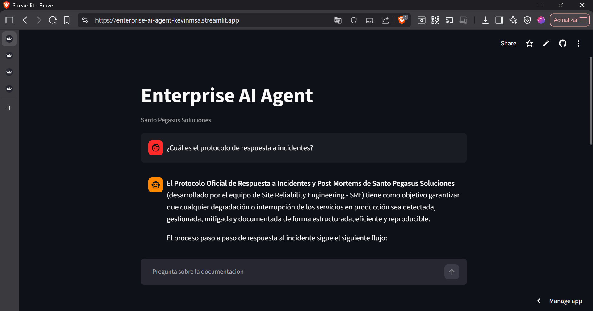
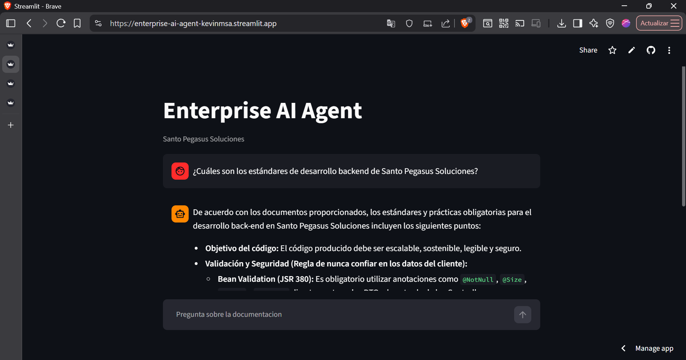
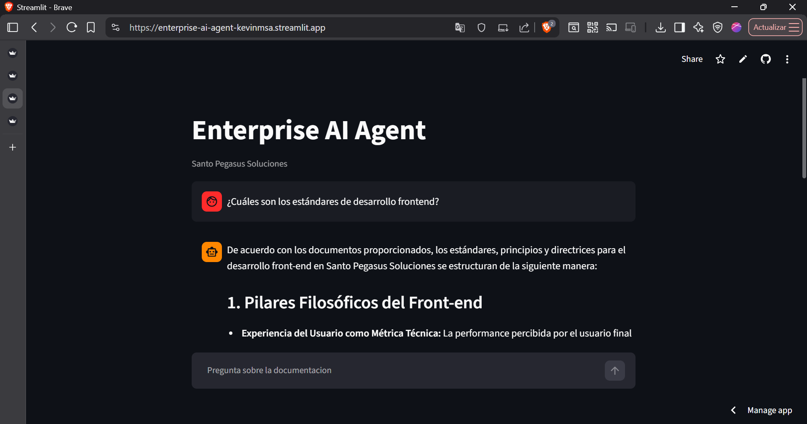
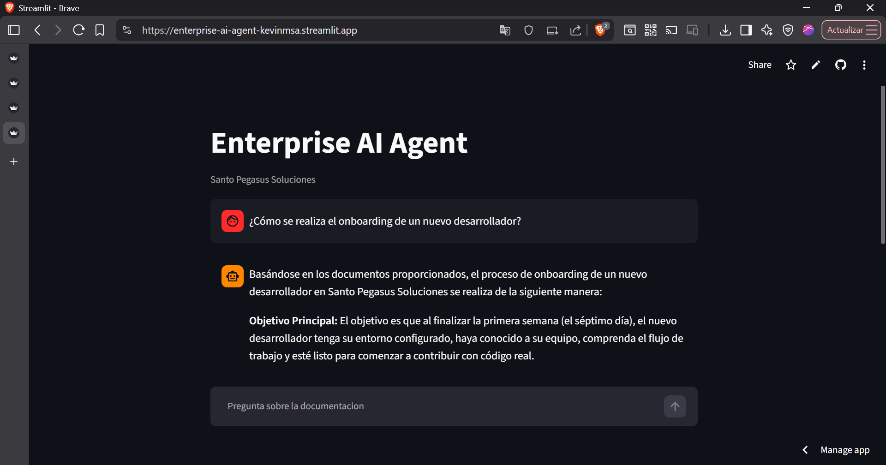
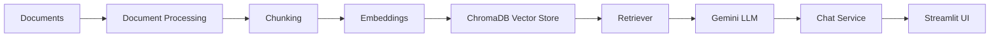

# Enterprise AI Agent

Enterprise AI Agent is a corporate knowledge assistant built with Retrieval-Augmented Generation (RAG) for Santo Pegasus Soluciones. The system allows users to ask questions about internal documentation and receive grounded answers generated by Gemini using semantic retrieval over a vector-based knowledge base.

> **Live Demo:** https://enterprise-ai-agent-kevinmsa.streamlit.app/
> **GitHub Repository:** https://github.com/Kevinmsa1/enterprise-ai-agent

## Screenshots

### Incident Response



### Backend Engineering Standards



### Frontend Engineering Standards



### Developer Onboarding



## Overview

This project provides a practical RAG-based assistant for exploring enterprise documentation. Instead of relying only on general language model knowledge, the application retrieves relevant context from a curated knowledge base and uses that context to generate more accurate and grounded responses.

The solution combines document ingestion, chunking, embeddings, vector indexing, semantic retrieval, and answer generation in a streamlined workflow that is exposed through a web interface built with Streamlit.

## Features

- Retrieval-Augmented Generation (RAG)
- Processing of business and technical documents
- Document chunking for efficient retrieval
- Embedding generation for semantic search
- Vector store powered by ChromaDB
- Semantic retrieval over indexed content
- Answer generation with Gemini
- Display of recovered sources and chunks
- Web interface with Streamlit
- Public deployment

## Knowledge Base

The knowledge base contains internal documentation for Santo Pegasus Soluciones, including:

- Official Back-end Engineering Guide
- Official Front-end Engineering Guide
- Microservices Architecture and Domain Map
- Incident Response Protocol and Post-Mortems
- Onboarding Manual for New Developers

## Architecture



## RAG Pipeline

The current pipeline follows these stages:

1. Document ingestion
2. Document parsing
3. Text chunking
4. Embedding generation
5. Vector indexing
6. Semantic retrieval
7. Context injection
8. Answer generation
9. Source display

## Technology Stack

- Python
- Streamlit
- LangChain
- Gemini API
- ChromaDB
- Sentence Transformers
- PyMuPDF
- python-dotenv

## Project Structure

The repository is organized as follows:

- data/raw: raw documents used as the source of knowledge
- data/processed: processed chunked data generated from the documents
- data/vector_store: persistent Chroma vector store files
- scripts: utilities for document processing and vector store build scripts
- src/config: configuration and environment settings
- src/data: document loading, parsing, and chunking logic
- src/rag: RAG components including embeddings, retriever, prompt, and QA chain
- src/services: chat service and application-facing service layer
- src/ui: Streamlit user interface components
- app.py: root entrypoint used by Streamlit

## Local Setup

### 1. Clone the repository

```powershell
git clone https://github.com/Kevinmsa1/enterprise-ai-agent.git
cd enterprise-ai-agent
```

### 2. Create a virtual environment

```powershell
python -m venv .venv
```

### 3. Activate the virtual environment

Windows PowerShell:

```powershell
.\.venv\Scripts\Activate.ps1
```

Windows CMD:

```cmd
.venv\Scripts\activate.bat
```

### 4. Install dependencies

```powershell
pip install -r requirements.txt
```

### 5. Create a .env file

Create a file named .env in the project root with the following content:

```env
GOOGLE_API_KEY=your_google_api_key_here
MODEL_NAME=gemini-3.5-flash
EMBEDDING_MODEL=models/gemini-embedding-001
```

### 6. Configure the Gemini API key

Set your Gemini API key as an environment variable. In a local environment, this is typically done through the .env file above. In a deployment platform, configure it as a secret or environment variable.

### 7. Run the application

```powershell
streamlit run app.py
```

## Document Processing

To process the raw documents and generate chunked output:

```powershell
python scripts/process_documents.py --input-dir data/raw --output-file data/processed/chunks.json
```

To build the vector store from the generated chunks:

```powershell
python scripts/build_vector_store.py --chunks-file data/processed/chunks.json --persist-dir data/vector_store
```

## Running the Application

Start the application locally with:

```powershell
streamlit run app.py
```

## Deployment

The application is publicly deployed through Streamlit Community Cloud connected to the GitHub repository.

- Deployed application: https://enterprise-ai-agent-kevinmsa.streamlit.app/
- Repository: https://github.com/Kevinmsa1/enterprise-ai-agent

## Example Questions

The assistant can answer questions such as:

- What is the incident response protocol?
- What are the backend development standards?
- What are the frontend development standards?
- How is onboarding handled for a new developer?

## Security

Sensitive credentials and API keys are not hardcoded in the application code. Environment variables and deployment platform secrets should be used to manage confidential configuration.

## Limitations

- Responses depend on the documentation available in the knowledge base.
- Answer quality depends on the relevance of retrieved context.
- The current UI shows the document and recovered chunks, but page numbering is not available in the present pipeline.
- The system is designed as a functional MVP for an enterprise RAG assistant.

## Future Improvements

- Improve page and section-level traceability
- Improve retrieval strategy
- Add reranking
- Add automated evaluation for RAG responses
- Add observability
- Add authentication and access control
- Expand the knowledge base
