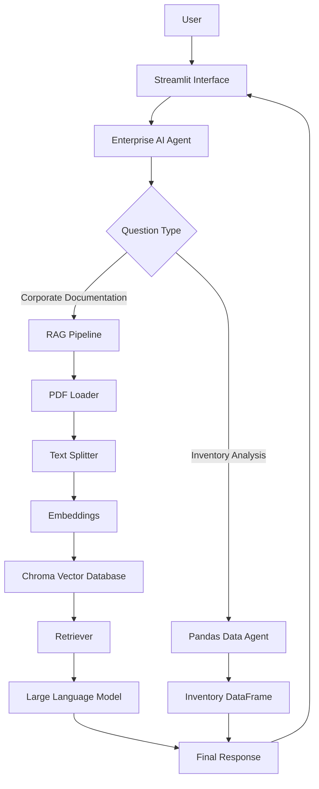
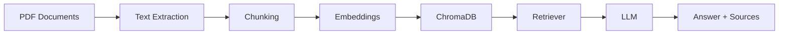

# Enterprise AI Agent
## Technical Design Document

1. Project Overview

2. Business Problem

3. Objectives

4. Scope

5. Users

6. Functional Requirements

7. Solution Architecture

8. RAG Pipeline

9. Project Structure

10. Technology Stack

11. Non-Functional Requirements

12. Development Roadmap

13. Future Improvements

# Enterprise AI Agent

> Technical Design Document

---

# 1. Project Overview

## Description

Enterprise AI Agent is an intelligent assistant designed to help employees quickly retrieve information from internal company documentation using Retrieval-Augmented Generation (RAG).

Instead of manually searching through multiple documents, users can ask questions in natural language and receive accurate answers supported by the organization's knowledge base.

The project combines Large Language Models (LLMs), semantic search, vector databases, and Oracle Cloud Infrastructure (OCI) to demonstrate a complete end-to-end AI solution.

---

# 2. Business Problem

Organizations generate large amounts of documentation, including onboarding manuals, engineering guides, operational procedures, policies, and technical documentation.

As documentation grows, employees spend considerable time searching for information across multiple files.

This project addresses that challenge by providing a centralized AI assistant capable of understanding company documentation and answering questions using verified information from official documents.

---

# 3. Objectives

The main objective is to build an AI-powered knowledge assistant capable of:

- Reading corporate documentation.
- Processing PDF documents.
- Creating semantic embeddings.
- Building a searchable vector database.
- Retrieving relevant information using RAG.
- Generating accurate answers using an LLM.
- Displaying cited document sources.
- Deploying the application on Oracle Cloud Infrastructure.

Additionally, the project aims to demonstrate practical knowledge of AI Engineering, LangChain, RAG architectures, Cloud Computing, and modern software development practices.

---

# 4. Scope

## Included

The first version of the project will include:

- Corporate document processing (PDF)
- Spreadsheet analysis (Excel/CSV)
- Semantic search using Retrieval-Augmented Generation (RAG)
- Natural language question answering
- Source citation for every answer
- Web interface built with Streamlit
- Oracle Cloud Infrastructure deployment

## Excluded

To keep the project focused and achievable within the available time, the following features are intentionally excluded from the first version:

- Multi-agent orchestration
- Authentication and authorization
- Continuous document synchronization
- OCR for scanned documents
- CI/CD pipelines
- Conversation memory across sessions
- Advanced monitoring dashboards

These features are considered future improvements.

---

# 5. Users

The application is intended for company employees who need quick access to internal information without manually searching through multiple documents.

Example users include:

- Software Developers
- Technical Leads
- Project Managers
- Human Resources
- Operations Teams
- Customer Support

---

# 6. Functional Requirements

The system shall:

- Read PDF documents.
- Read spreadsheet files.
- Process and split documents into semantic chunks.
- Generate vector embeddings.
- Store embeddings in a vector database.
- Retrieve relevant information using semantic search.
- Answer questions using a Large Language Model.
- Display the source document used to generate each response.
- Analyze structured spreadsheet data.
- Provide a simple web interface for interaction.

---

# 7. Solution Architecture



---

# 8. RAG Pipeline

The Retrieval-Augmented Generation (RAG) pipeline follows these stages:

1. Document ingestion.
2. Text extraction.
3. Text cleaning.
4. Chunk generation.
5. Embedding creation.
6. Vector database indexing.
7. Semantic retrieval.
8. Context generation.
9. Answer generation using an LLM.
10. Source citation.



---

# 9. Project Structure

The project follows a modular architecture to improve maintainability and scalability.

```text
enterprise-ai-agent/

│

├── docs/

├── documents/

├── notebooks/

├── src/

│ ├── agents/

│ ├── config/

│ ├── core/

│ ├── data/

│ ├── rag/

│ ├── ui/

│ └── utils/

├── tests/

├── README.md

├── requirements.txt

└── .env.example
```

# 10. Technology Stack

The project will be developed using a modern AI application stack focused on Retrieval-Augmented Generation (RAG), intelligent agents, and cloud deployment.

## Programming Language

**Python 3.11+**

Python will be used as the main programming language due to its strong ecosystem for Artificial Intelligence, Machine Learning, data processing, and integration with Large Language Models (LLMs).

## AI Frameworks
- LangChain

### LangChain

LangChain will be used to build the RAG pipeline and manage the interaction between:

- Document loaders.
- Text processing.
- Embedding generation.
- Vector database retrieval.
- Language model responses.

### LangGraph

LangGraph will be used to structure the agent workflow as a state-based graph, allowing better control over the reasoning flow and future expansion into more complex agent behaviors.

## Large Language Model (LLM)
- Google Gemini API

The project will integrate a Large Language Model capable of generating natural language responses based on retrieved information from the knowledge base.

The selected model will be defined during implementation according to:

- Availability.
- Cost.
- Performance.
- Integration simplicity.

Possible options include:

- Google Gemini.
- OpenAI models.
- Other compatible LLM providers.

## Document Processing

The agent will support document ingestion from different formats.

Technologies:

- **PyPDF** for PDF document extraction.
- **Pandas** for CSV and structured data processing.

The processing pipeline will transform raw documents into clean text segments ready for indexing.

## Embeddings and Vector Database
- Google Generative AI Embeddings

The project will use embeddings to transform document fragments and user questions into numerical representations.

A vector database will be responsible for storing and retrieving relevant information through semantic search.

Possible implementations:

- ChromaDB.
- FAISS.
- Other compatible vector storage solutions.

The final selection will consider simplicity, performance, and deployment requirements.

## User Interface

### Streamlit

Streamlit will be used to create a lightweight web interface where users can interact with the AI agent through a conversational experience.

The interface will prioritize functionality over visual complexity.

## Containerization

### Docker

Docker will be used to package the application and its dependencies, ensuring consistency between local development and cloud deployment environments.

## Version Control

### Git and GitHub

Git and GitHub will be used for:

- Source code management.
- Version history.
- Project documentation.
- Collaboration and portfolio presentation.

## Cloud Infrastructure

### Oracle Cloud Infrastructure (OCI)

OCI will be used to deploy the final application.

The deployment will include at least one OCI service as required by the challenge.

Initial deployment strategy:

- OCI Compute for application hosting.
- Secure environment configuration.
- Public access to the deployed agent.

Future improvements may include additional OCI services for storage, monitoring, and scalability.

# 11. Non-Functional Requirements

The following non-functional requirements define the quality attributes and engineering principles that guide the development of the AI Agent.

## Performance

The system should provide responses within an acceptable time for interactive usage.

Considerations:

- Optimize document retrieval through vector similarity search.
- Limit the amount of context sent to the LLM.
- Use efficient chunking strategies during document processing.
- Avoid unnecessary processing during user queries.

## Accuracy and Response Quality

The agent should provide reliable answers based only on the information available in the knowledge base.

Requirements:

- Responses must be generated using retrieved document context.
- The system should avoid generating unsupported information.
- When the required information is not available, the agent should clearly state that no relevant information was found.
- Responses should include references to the source documents whenever possible.

## Security

The application must protect sensitive information and credentials.

Security practices:

- API keys and credentials must not be stored directly in the source code.
- Environment variables will be used for configuration.
- Sensitive files will be excluded from version control.
- Access to cloud resources must follow secure configuration practices.

## Maintainability

The project should be easy to understand, modify, and extend.

Practices:

- Organized project structure.
- Clear separation between components.
- Documentation of architecture and decisions.
- Version control using Git with meaningful commits.
- Modular implementation of the RAG pipeline.

## Scalability

The architecture should allow future growth without requiring a complete redesign.

Possible future improvements:

- Support for additional document formats.
- Integration with larger document repositories.
- Migration to managed vector databases.
- Multiple knowledge domains.
- More advanced agent workflows.

## Availability

The deployed application should be accessible through the cloud environment.

The solution should consider:

- Stable deployment configuration.
- Proper dependency management.
- Basic error handling.
- Monitoring opportunities for future improvements.

## Usability

The interface should allow users without technical knowledge to interact with the agent.

Requirements:

- Simple conversational interface.
- Clear indication that the user is interacting with an AI system.
- Understandable responses.
- Minimal configuration required from the user.

## Reproducibility

Another developer should be able to run and understand the project.

This will be supported through:

- README documentation.
- Dependency management.
- Environment configuration example.
- Deployment instructions.
- GitHub repository history.

# 12. Development Roadmap

The project will be developed through incremental phases, following an agile approach. Each phase represents a milestone that moves the solution from initial planning to a functional cloud-deployed AI Agent.

## Phase 1 - Project Planning and Setup

Objective:

Establish the project foundation and development environment.

Activities:

- Create and configure the GitHub repository.
- Define the project structure.
- Create initial documentation.
- Configure environment variables.
- Prepare development tools.

Expected result:

A structured repository ready for implementation.

---

## Phase 2 - Knowledge Base Creation

Objective:

Prepare the documents that will serve as the agent's knowledge source.

Activities:

- Select the business context of the project.
- Create or adapt documentation files.
- Organize documents by category.
- Validate document quality and relevance.

Expected result:

A curated knowledge base ready for processing.

---

## Phase 3 - Document Processing Pipeline

Objective:

Transform documents into usable information for the AI system.

Activities:

- Load documents from the knowledge base.
- Extract text from supported formats.
- Clean and normalize extracted content.
- Split documents into meaningful chunks.
- Generate document metadata.

Expected result:

Processed documents prepared for indexing.

---

## Phase 4 - RAG Implementation

Objective:

Build the retrieval-augmented generation pipeline.

Activities:

- Generate embeddings from document chunks.
- Store vectors in a vector database.
- Implement semantic search.
- Connect retrieval results with the language model.
- Create prompts focused on grounded responses.

Expected result:

A functional RAG system capable of answering questions based on documents.

---

## Phase 5 - AI Agent Development

Objective:

Create the intelligent agent responsible for user interaction.

Activities:

- Integrate LangChain components.
- Structure agent workflow.
- Implement response generation logic.
- Add source references.
- Handle unavailable information scenarios.

Expected result:

An AI Agent capable of answering natural language questions.

---

## Phase 6 - User Interface Development

Objective:

Provide a simple interface for interacting with the agent.

Activities:

- Create Streamlit application.
- Connect interface with the agent backend.
- Display responses clearly.
- Show document references.

Expected result:

A usable conversational application.

---

## Phase 7 - Cloud Deployment

Objective:

Make the application available online.

Activities:

- Prepare deployment environment.
- Configure OCI resources.
- Deploy the application.
- Validate public accessibility.
- Capture execution evidence.

Expected result:

A working AI Agent deployed on Oracle Cloud Infrastructure.

---

## Phase 8 - Documentation and Final Delivery

Objective:

Prepare the project for evaluation and portfolio presentation.

Activities:

- Complete README documentation.
- Add architecture diagrams.
- Add screenshots or videos.
- Review repository organization.
- Verify deployment links.

Expected result:

A complete public GitHub project ready for submission and presentation.

# 13. Future Improvements

Although the current project focuses on creating a functional AI Agent with RAG capabilities, several improvements could be implemented in future versions to transform the solution into a more complete enterprise platform.

## Multi-Agent Architecture

Future versions could incorporate multiple specialized agents working together.

Examples:

- Human Resources Agent.
- Financial Agent.
- Technical Documentation Agent.
- Legal Compliance Agent.

A supervisor agent could determine which specialized agent should process each user request.

## Support for Additional Document Sources

The current solution focuses on local document ingestion, but future improvements could include integrations with:

- Google Drive.
- Microsoft SharePoint.
- Internal company repositories.
- Knowledge management platforms.
- Enterprise databases.

This would allow automatic synchronization of the knowledge base.

## Advanced Access Control

For enterprise environments, the system could implement role-based access control.

Possible improvements:

- Authentication with corporate accounts.
- Permission-based document retrieval.
- Different knowledge visibility levels according to user roles.

## Automated Knowledge Base Updates

A future version could include automatic document monitoring.

Capabilities:

- Detect new documents.
- Detect document modifications.
- Reprocess updated files.
- Refresh embeddings automatically.

This would keep the agent continuously updated.

## Advanced Monitoring and Analytics

The system could include observability features to evaluate performance.

Possible metrics:

- Number of user interactions.
- Most requested topics.
- Response latency.
- Retrieval accuracy.
- User feedback analysis.

## Evaluation Framework

Future versions could include automated evaluation of generated answers.

Examples:

- Retrieval quality measurement.
- Response relevance scoring.
- Hallucination detection.
- Comparison between different prompts or models.

## Improved Cloud Architecture

The current deployment focuses on simplicity and functionality.

A production-level architecture could include:

- OCI Object Storage for document management.
- OCI Vault for secret management.
- Managed vector database solutions.
- Container orchestration.
- Automated CI/CD pipelines.
- Monitoring and logging services.

## Enhanced User Experience

The interface could evolve with additional capabilities:

- Conversation history.
- User feedback collection.
- File upload functionality.
- Source visualization.
- Integration with communication platforms such as Slack or Microsoft Teams.

These improvements would transform the current prototype into a scalable enterprise AI knowledge assistant.

- Preserve PDF page numbers in chunk metadata.
- Improve retrieval by using contextual chunking.
- Add reranking.
- Hybrid search (BM25 + Vector Search).
- Better source citations.