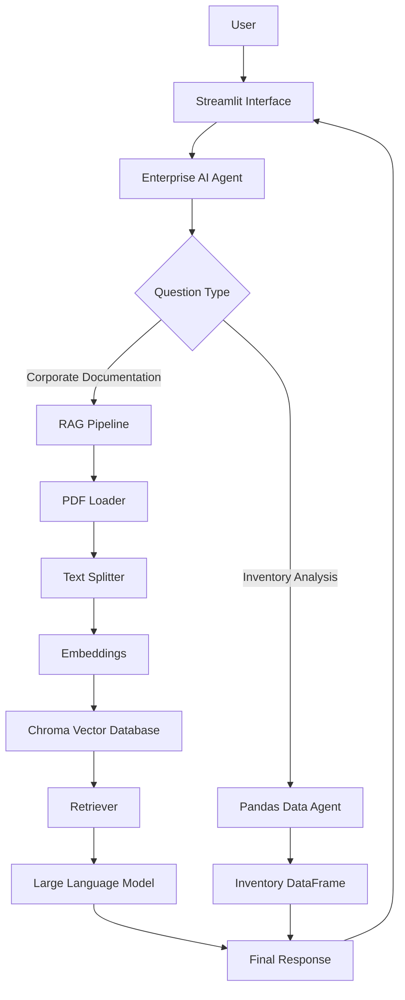
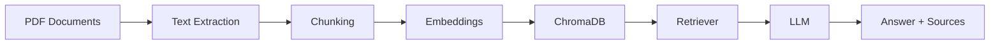

# Enterprise AI Agent
## Technical Design Document

1. Project Overview

2. Business Problem

3. Objectives

4. Scope

5. Users

6. Functional Requirements

7. Solution Architecture

8. RAG Pipeline

9. Project Structure

10. Technology Stack

11. Non-Functional Requirements

12. Development Roadmap

13. Future Improvements

# Enterprise AI Agent

> Technical Design Document

---

# 1. Project Overview

## Description

Enterprise AI Agent is an intelligent assistant designed to help employees quickly retrieve information from internal company documentation using Retrieval-Augmented Generation (RAG).

Instead of manually searching through multiple documents, users can ask questions in natural language and receive accurate answers supported by the organization's knowledge base.

The project combines Large Language Models (LLMs), semantic search, vector databases, and Oracle Cloud Infrastructure (OCI) to demonstrate a complete end-to-end AI solution.

---

# 2. Business Problem

Organizations generate large amounts of documentation, including onboarding manuals, engineering guides, operational procedures, policies, and technical documentation.

As documentation grows, employees spend considerable time searching for information across multiple files.

This project addresses that challenge by providing a centralized AI assistant capable of understanding company documentation and answering questions using verified information from official documents.

---

# 3. Objectives

The main objective is to build an AI-powered knowledge assistant capable of:

- Reading corporate documentation.
- Processing PDF documents.
- Creating semantic embeddings.
- Building a searchable vector database.
- Retrieving relevant information using RAG.
- Generating accurate answers using an LLM.
- Displaying cited document sources.
- Deploying the application on Oracle Cloud Infrastructure.

Additionally, the project aims to demonstrate practical knowledge of AI Engineering, LangChain, RAG architectures, Cloud Computing, and modern software development practices.

---

# 4. Scope

## Included

The first version of the project will include:

- Corporate document processing (PDF)
- Spreadsheet analysis (Excel/CSV)
- Semantic search using Retrieval-Augmented Generation (RAG)
- Natural language question answering
- Source citation for every answer
- Web interface built with Streamlit
- Oracle Cloud Infrastructure deployment

## Excluded

To keep the project focused and achievable within the available time, the following features are intentionally excluded from the first version:

- Multi-agent orchestration
- Authentication and authorization
- Continuous document synchronization
- OCR for scanned documents
- CI/CD pipelines
- Conversation memory across sessions
- Advanced monitoring dashboards

These features are considered future improvements.

---

# 5. Users

The application is intended for company employees who need quick access to internal information without manually searching through multiple documents.

Example users include:

- Software Developers
- Technical Leads
- Project Managers
- Human Resources
- Operations Teams
- Customer Support

---

# 6. Functional Requirements

The system shall:

- Read PDF documents.
- Read spreadsheet files.
- Process and split documents into semantic chunks.
- Generate vector embeddings.
- Store embeddings in a vector database.
- Retrieve relevant information using semantic search.
- Answer questions using a Large Language Model.
- Display the source document used to generate each response.
- Analyze structured spreadsheet data.
- Provide a simple web interface for interaction.

---

# 7. Solution Architecture



---

# 8. RAG Pipeline

The Retrieval-Augmented Generation (RAG) pipeline follows these stages:

1. Document ingestion.
2. Text extraction.
3. Text cleaning.
4. Chunk generation.
5. Embedding creation.
6. Vector database indexing.
7. Semantic retrieval.
8. Context generation.
9. Answer generation using an LLM.
10. Source citation.



---

# 9. Project Structure

The project follows a modular architecture to improve maintainability and scalability.

```text
enterprise-ai-agent/

│

├── docs/

├── documents/

├── notebooks/

├── src/

│ ├── agents/

│ ├── config/

│ ├── core/

│ ├── data/

│ ├── rag/

│ ├── ui/

│ └── utils/

├── tests/

├── README.md

├── requirements.txt

└── .env.example
```

# 10. Technology Stack

The project will be developed using a modern AI application stack focused on Retrieval-Augmented Generation (RAG), intelligent agents, and cloud deployment.

## Programming Language

**Python**

Python will be used as the main programming language due to its strong ecosystem for Artificial Intelligence, Machine Learning, data processing, and integration with Large Language Models (LLMs).

## AI Frameworks

### LangChain

LangChain will be used to build the RAG pipeline and manage the interaction between:

- Document loaders.
- Text processing.
- Embedding generation.
- Vector database retrieval.
- Language model responses.

### LangGraph

LangGraph will be used to structure the agent workflow as a state-based graph, allowing better control over the reasoning flow and future expansion into more complex agent behaviors.

## Large Language Model (LLM)

The project will integrate a Large Language Model capable of generating natural language responses based on retrieved information from the knowledge base.

The selected model will be defined during implementation according to:

- Availability.
- Cost.
- Performance.
- Integration simplicity.

Possible options include:

- Google Gemini.
- OpenAI models.
- Other compatible LLM providers.

## Document Processing

The agent will support document ingestion from different formats.

Technologies:

- **PyPDF** for PDF document extraction.
- **Pandas** for CSV and structured data processing.

The processing pipeline will transform raw documents into clean text segments ready for indexing.

## Embeddings and Vector Database

The project will use embeddings to transform document fragments and user questions into numerical representations.

A vector database will be responsible for storing and retrieving relevant information through semantic search.

Possible implementations:

- ChromaDB.
- FAISS.
- Other compatible vector storage solutions.

The final selection will consider simplicity, performance, and deployment requirements.

## User Interface

### Streamlit

Streamlit will be used to create a lightweight web interface where users can interact with the AI agent through a conversational experience.

The interface will prioritize functionality over visual complexity.

## Containerization

### Docker

Docker will be used to package the application and its dependencies, ensuring consistency between local development and cloud deployment environments.

## Version Control

### Git and GitHub

Git and GitHub will be used for:

- Source code management.
- Version history.
- Project documentation.
- Collaboration and portfolio presentation.

## Cloud Infrastructure

### Oracle Cloud Infrastructure (OCI)

OCI will be used to deploy the final application.

The deployment will include at least one OCI service as required by the challenge.

Initial deployment strategy:

- OCI Compute for application hosting.
- Secure environment configuration.
- Public access to the deployed agent.

Future improvements may include additional OCI services for storage, monitoring, and scalability.

